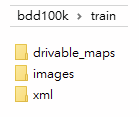

# BDD100k toolkit

Convert bdd100k dataset to lmdb , for train [object detection + segmentation models](https://github.com/eric612/MobileNet-YOLO)

1. Download bdd100k dataset (images and driverable map) and save at $bdd100k/bdd100k , and download conveted coco detection [json](https://drive.google.com/open?id=1MI0KzphTY5a1wijXvJua3X4X0woLrSUw)
2. python batch_split_annotation.py (change the data path beforce split) , you will generate mass json files here 
    ```
    coco_data_dir = "{}/data/bdd100k/bdd100k".format(HOMEDIR) 
    anno_sets = ["bdd100k_labels_images_det_coco_train", "bdd100k_labels_images_det_coco_val"] // step1 files
    anno_dir = "{}/json".format(coco_data_dir) //step1 folder
    ```
    The generated train and val will save at $bdd100k/bdd100k/ImageSets
3. Use coco2voc.py to convert step2 files format to pascal voc , the file tree will like below 



4. 
```
Python create_list.py train train
```
